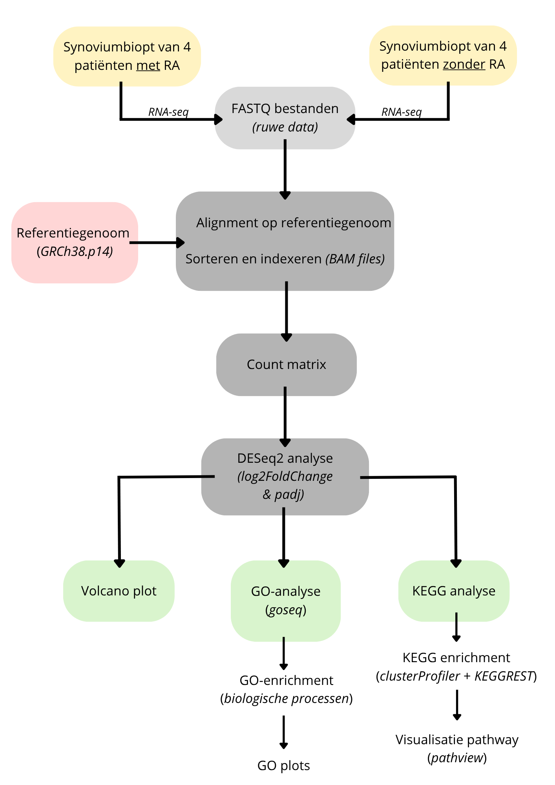

# 🔬RNA-seq analyse van reumatoïde artritis: differentiële genexpressie en GO-analyse
Nina Fonsine Schakel - [nina.schakel\@student.nhlstenden.com](mailto:nina.schakel@student.nhlstenden.com) - NHL Stenden en Van Hall Larenstein - Module J2P4_BT Moderne DNA-technologieën

Datum: 29-05-2026

## Inleiding:
Reumatoïde artritis (RA) is een vorm van reuma die ervoor zorgt dat het immuunsysteem lichaamseigen weefsel aanvalt, voornamelijk de synoviale gewrichten. Dit leidt vaak tot pijn, ontstekingen, en zelfs schade aan bot en kraakbeen. In 2024 kregen 11.700 mensen de diagnose RA in Nederland [[1]](Referenties). Helaas is er momenteel geen genezing en wordt de ontwikkeling van effectieve therapieën bemoeilijkt door de variatie aan ziekteverloop tussen patiënten [[2]](Referenties)[[3]](Referenties).
 

Om gerichte therapieën te ontwikkelen, is het essentieel om te begrijpen wat er op moleculair niveau gebeurt in het geval van RA. Chronische ontsteking en gewrichtsschade wordt gestimuleerd door een interactie van verschillende immuuncellen en (pro-inflammatoire) cytokinen, waaronder TNF-α, IL-6 en IL-17. RNA sequencing (RNA-seq) is een krachtige methode die verandering in genexpressie kan detecteren op grote schaal en zo inzicht kan bieden in de onderliggende mechanismen van deze ziekte.

In dit onderzoek wordt door middel van RNA-seq geïdentificeerd welke genen differentieel tot expressie zijn gebracht in acht patiënten met en zonder RA. Met behulp van GO- en KEGG-analyse worden de bijbehorende biologische processen en pathways gekarakteriseerd.

## Methode: 
+- 200 woorden met methode, flowschema. Zie leerdoelen voor minimale inhoud. Scripts, data etc. kunnen in een aparte folder met verwijzing.

  

## Resultaten: 
+- 200 woorden, inclusief correcte verwijzingen. Packages met versienummer en bronnen.

## Conclusie:
+- 200 woorden, inclusief aanbevelingen en onderzoek in context plaatsen.

## Referenties
Zie [Referenties](Referenties)

## AI Gebruik

## Competentie beheren
Zie [Data_Stewardship](Data_Stewardship) en [Beheren](Beheren)
