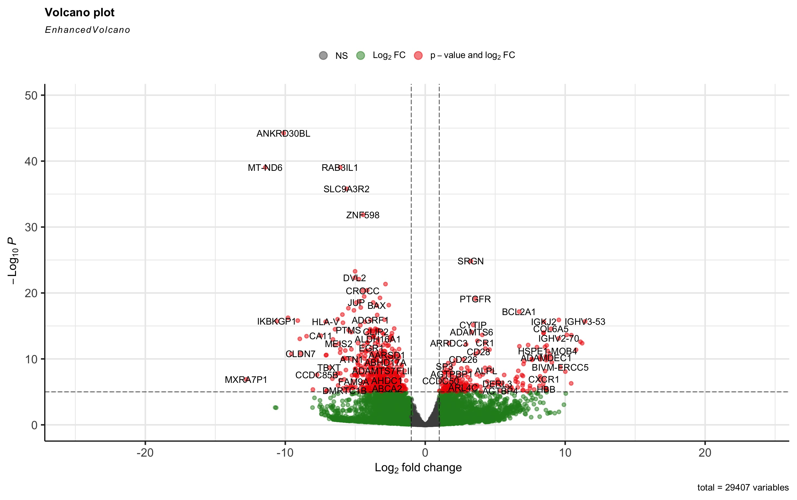
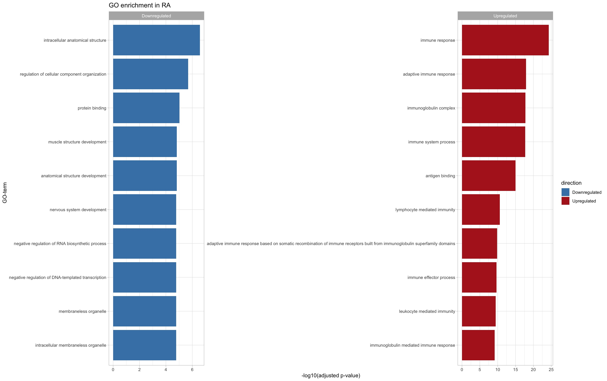
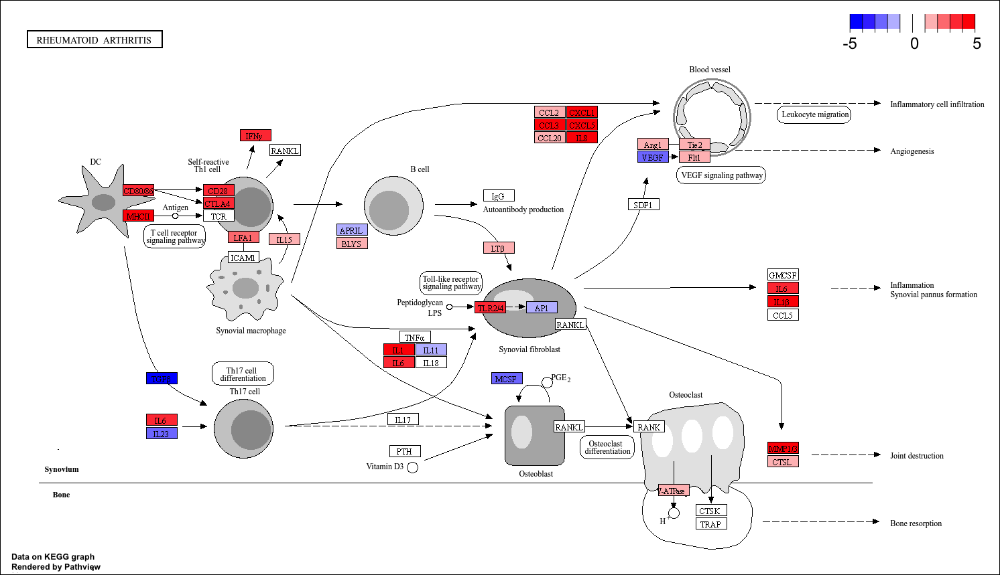

# 🔬Activatie van immuun- en ontstekingsroutes in reumatoïde artritis onthuld door RNA-seq analyse
Nina Fonsine Schakel - [nina.schakel\@student.nhlstenden.com](mailto:nina.schakel@student.nhlstenden.com) - NHL Stenden en Van Hall Larenstein - Module J2P4_BT Moderne DNA-technologieën

Datum: 29-05-2026

## 🩺Inleiding:
Reumatoïde artritis (RA) is een vorm van reuma waarbij het immuunsysteem lichaamseigen weefsel aanvalt, voornamelijk de synoviale gewrichten. Dit leidt tot pijn, ontstekingen en schade aan bot en kraakbeen. In 2024 kregen 11.700 mensen de diagnose RA in Nederland [[1]](Referenties). Er is momenteel geen genezing en de ontwikkeling van effectieve therapieën wordt bemoeilijkt door variatie aan ziekteverloop tussen patiënten [[2]](Referenties)[[3]](Referenties).

Om gerichte therapieën te ontwikkelen, is informatie over wat er op moleculair niveau gebeurt in het geval van RA essentieel. Chronische ontsteking en gewrichtsschade wordt gestimuleerd door interacties tussen immuuncellen en (pro-inflammatoire) cytokinen, waaronder TNF-α, IL-6 en IL-17 [[4]](Referenties)[[5]](Referenties)[[6]](Referenties). RNA sequencing (RNA-seq) is een methode die verandering in genexpressie kan detecteren op grote schaal en zo inzicht kan bieden in de onderliggende mechanismen van deze ziekte.

In dit onderzoek werd met RNA-seq geïdentificeerd welke genen differentieel tot expressie zijn gebracht in een synoviumbiopt van acht personen met en zonder RA. Met behulp van GO- en KEGG-analyse worden de bijbehorende biologische processen en pathways gekarakteriseerd.

## 💻Methode: 
Ruwe sequencingdata ([FASTQ-bestanden](Data/Ruw) werden gemapt op het [humane referentiegenoom](Referentiegenoom) nadat dit vooraf was geïndexeerd met het Rsubread (v2.25.0)[[7]](Referenties) package. De verkregen BAM-bestanden werden vervolgens gesorteerd en geïndexeerd met Rsamtools.

Hierna werd met featureCounts uit hetzelfde Rsubread package een [count matrix](count_matrix_RA.txt) opgesteld op basis van een [GTF-annotatiebestand](Referentiegenoom). Deze count matrix werd vervolgens gebruikt voor differentiële genexpressieanalyse met DESeq2 (v1.50.2)[[8]](Referenties), waarbij significante genen werden geselecteerd op basis van padj < 0,05 en |log2 fold change| > 1.

Voor functionele interpretatie werden Gene Ontology (GO) en KEGG pathway analyses uitgevoerd. GO-enrichment werd uitgevoerd met goseq (v1.62.0)[[9]](Referenties), waarbij gecorrigeerd werd voor genlengtebias met hg19, en genannotatie werd verkregen via het org.Hs.eg.db (v3.22.0)[[10]](Referenties) package. KEGG-enrichment werd bepaald met het clusterProfiler (v4.18.4)[[11]](Referenties) package, waarbij pathway-informatie werd opgehaald via KEGGREST (v1.50.0)[[12]](Referenties).

Ter visualisatie werden volcano plots en enrichment plots gemaakt met ggplot2 (v4.0.3)[[13]](Referenties), dplyr (v1.2.1)[[14]](Referenties) en EnhancedVolcano (v1.28.2)[[15]](Referenties) packages. Pathview (v1.50.0)[[16]](Referenties) werd gebruikt om differentiële genexpressie te tonen op de KEGG rheumatoid arthritis pathway (ksa05323)[[17]](Referenties).

Een flowschema van de analysepipeline is weergegeven in [figuur 1](Flowschema.png).

  

Figuur 1. Flowschema van het onderzoek waarbij de RNA-seq data van patiëntmonsters wordt verwerkt tot een volcano plot, GO plots en de visualisatie van een specifieke pathway

## 📊Resultaten: 
De differentiële genexpressieanalyse met DESeq2 identificeerde een groot aantal genen die significant verschillend tot expressie kwamen tussen gezonde individuen en RA‑patiënten. In totaal werden meer genen gevonden die downregulated waren dan upregulated, wat visueel weergegeven is in de [volcano plot](VolcanoPlotRA.jpg) (figuur2), waarin ook duidelijk een scheiding zichtbaar is tussen significante (rood gekleurd) en niet-significante genen.

  

Figuur2. Volcano plot van de differentiële genexpressie tussen individuen met en zonder RA. De x-as toont de log2 fold change en de y-toont de –log10 van de adjusted p‑waarde. Genen met een hoge absolute log2 fold change en lage p‑waarde zijn significant verschillend tot expressie gebracht (weergegeven in het rood). Upregulated genen bevinden zich rechts van de lijn, terwijl downregulated genen zich links bevinden.

De GO‑analyse liet zien dat upregulated genen vooral sterk verhoogd tot expressie kwamen in immuun- en ontstekingsgerelateerde processen, zoals cytokineproductie en immuunrespons. Downregulated genen hadden voornamelijk een verhoogde expressie in algemene cellulaire processen, waaronder structuur en metabolisme. Deze bevindingen werden bevestigd door de [top‑10 analyse](Top10_processen.jpg) (figuur3), waarin de meest significante GO-termen bij upregulated genen gekoppeld waren aan ontstekingsmechanismen.

  

Figuur3. Top 10 verrijkte GO-termen voor up- en downregulated genen bij RA. De hoogte van de balken geeft de −log10(adjusted p‑waarde weer.

KEGG pathway analyse toonde een duidelijke verrijking van pathways betrokken bij RA, waaronder de cytokinesignalering en T‑celactivatie. Met name pathways zoals de TNF- en IL-17 signaleringsroutes kwamen naar voren in de upregulated genen. De pathview visualisatie van de [rheumatoid arthritis pathway (hsa05323)](hsa05323.RA_pathway.png) (figuur4) bevestigde deze resultaten, waarbij meerdere genen binnen ontstekingsroutes verhoogde expressie vertoonden (weergegeven in het rood).

  

Figuur4. KEGG pathway analyse van RA (hsa05323) pathway met differentieel tot expressie gebrachte genen. Rood gekleurde genen horen bij een log2 fold change boven de 1 (upregulated) en blauw gekleurde genen horen bij een log2 fold change onder de -1 (downregulated). De componenten van de TNF- en IL-17 signaleringsroutes vertonen met name een verhoogde expressie.

Deze resultaten wijzen gezamelijk op een sterke activatie van immuun- en ontstekingsprocessen bij RA. Dit is consistent met het bekende pathologische mechanisme van de ziekte [[18]](Referenties).

## 📖Conclusie:
In dit onderzoek werd RNA-seq analyse gebruikt om de verschillen in genexpressie tussen patiënten met en zonder RA te identificeren. De resultaten tonen een duidelijke upregulatie van genen die betrokken zijn bij o.a. immuun- en ontstekingsprocessen, terwijl de downregulated genen voornamelijk gerelateerd zijn aan algemene cellulaire processen. De GO  en KEGG analyses wijzen beide op een versterkte activatie van pro inflammatoire pathways, zoals cytokinesignalering en T celactivatie. De pathview analyse bevestigt deze bevindingen door het tonen van een verhoogde expressie van genen binnen de rheumatoid arthritis pathway (hsa05323).

Deze resultaten zijn consistent met het bekende mechanisme van RA als auto-immuunziekte gekenmerkt door chronische ontstekingen. Het kleine aantal monster maakt het onderzoek echter beperkt. Ondanks deze beperkingen dragen deze resultaten bij aan een beter begrip van de moleculaire mechanismen van RA. Voor toekomstige onderzoeken wordt aanbevolen om meer monsters te nemen en eventueel het gebruik van gedetailleerde technieken, zoals single-cell RNA-seq. 

## Referenties
Zie [Referenties](Referenties)

## AI Gebruik

## Competentie beheren
Zie [Data_Stewardship](Data_Stewardship) en [Beheren](Beheren)
